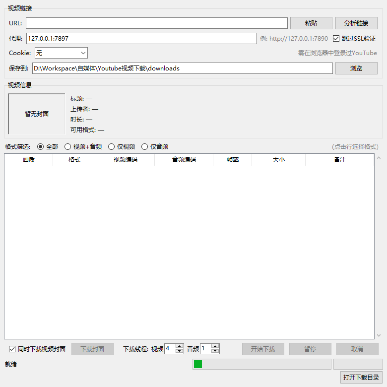

# YouTube Downloader GUI

A simple desktop video downloader built with yt-dlp + tkinter.

[中文说明](README_CN.md)

## Features

- Paste a YouTube / Bilibili / etc. link and analyze all available formats in one click
- Format table showing resolution, codec, FPS, file size with four filter modes
- Download cover as PNG (standalone or alongside video)
- Proxy support + browser cookie login
- Pause / Cancel / Resume download
- Per-format concurrency control (video / audio tuned separately)
- Fragment progress grid (Canvas-rendered, real-time color update)
- Translated error messages for common yt-dlp errors
- Chrome UA spoofing + request interval anti-detection
- Optional aria2c integration (16 connections per file)
- Settings auto-persistence

## Install

```bash
# First-time setup
setup.bat

# Launch
run.bat
```

Or manually:

```bash
python -m venv venv
venv\Scripts\python.exe -m pip install -r requirements.txt
venv\Scripts\python.exe yt_downloader_gui.py
```

## Usage

1. Configure proxy if needed
2. Select browser from Cookie dropdown (must be logged into YouTube)
3. Paste link → Analyze
4. Choose format → Download

## FAQ

| Problem | Fix |
|---|---|
| SSL error | Check "Skip SSL verify" |
| Bot detection | Select browser in Cookie dropdown |
| Slow download | Increase video threads, or install aria2c |
| Tuple comparison error | Try a different format or restart |

## Screenshot



## Dependencies

- Python 3.10+
- yt-dlp
- Pillow
- ffmpeg (system install, for format merging)
- aria2c (optional, place in project directory)

## License

MIT
